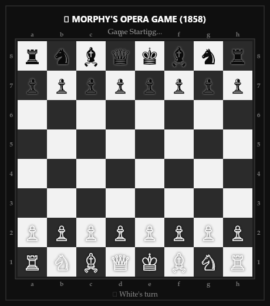

<p align="center">
  
</p>

<div align="center">

  # Hi 👋, I'm Yuu

  <a href="https://git.io/typing-svg">
    
  </a>

  <br><br>

  

  <br><br>

  <!-- Social Links -->
  <a href="https://instagram.com/yuuukoito" target="_blank">
    
  </a>
  &nbsp;
  <a href="https://discord.gg/lilyamanee._33887" target="_blank">
    
  </a>

</div>

<br>

---

### 💫 About Me
```yaml
name: Yuu
location: Indonesia 🇮🇩
interests: Web Development, IoT & Arduino
status: Building aesthetic digital experiences ✨
```

---

### 🛠️ Tech Stack & Tools

<div align="center">

  <!-- Frontend & Web -->
  <a href="https://www.w3.org/html/" target="_blank" rel="noreferrer">
    
  </a>
  &nbsp;
  <a href="https://www.w3schools.com/css/" target="_blank" rel="noreferrer">
    
  </a>
  &nbsp;
  <a href="https://developer.mozilla.org/en-US/docs/Web/JavaScript" target="_blank" rel="noreferrer">
    
  </a>
  &nbsp;
  <a href="https://flutter.dev" target="_blank" rel="noreferrer">
    
  </a>
  &nbsp;
  <a href="https://www.chartjs.org" target="_blank" rel="noreferrer">
    
  </a>

  <br><br>

  <!-- Backend & Database -->
  <a href="https://nodejs.org" target="_blank" rel="noreferrer">
    
  </a>
  &nbsp;
  <a href="https://expressjs.com" target="_blank" rel="noreferrer">
    
  </a>
  &nbsp;
  <a href="https://www.php.net" target="_blank" rel="noreferrer">
    
  </a>
  &nbsp;
  <a href="https://www.mysql.com/" target="_blank" rel="noreferrer">
    
  </a>
  &nbsp;
  <a href="https://www.sqlite.org/" target="_blank" rel="noreferrer">
    
  </a>

  <br><br>

  <!-- Hardware, Systems & Game Dev -->
  <a href="https://www.w3schools.com/cpp/" target="_blank" rel="noreferrer">
    
  </a>
  &nbsp;
  <a href="https://www.arduino.cc/" target="_blank" rel="noreferrer">
    
  </a>
  &nbsp;
  <a href="https://unity.com/" target="_blank" rel="noreferrer">
    
  </a>

</div>

<br>

---

### 🔥 Contribution Activity

<div align="center">
  
</div>

<br>

---

<div align="center">
  <h3>♟️ Immortal Opera Game (1858) — Paul Morphy</h3>
  
  <p><sub><i>Aesthetic monochrome looping replay of Paul Morphy's legendary Queen sacrifice & checkmate</i></sub></p>
</div>
