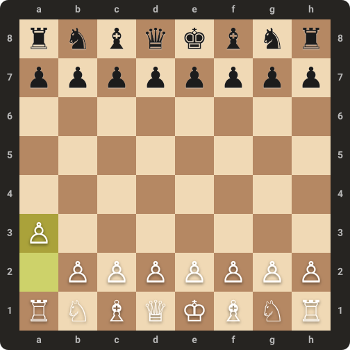

  

<h1 align="center">Hi 👋, I'm yuu</h1>
<h3 align="center">A passionate frontend developer from Indonesia 🇮🇩</h3>

  

<h3 align="left">Connect with me:</h3>

<h3 align="left">Languages and Tools:</h3>

  

---

<!-- CHESS_GAME:START -->
### ♟️ Community Chess in Profile README

  

  **Turn:** ⚪ White to move &nbsp;•&nbsp; Game #2 in progress &nbsp;•&nbsp; [🔄 Start New Game](https://github.com/yuuuukoito/yuuuukoito/issues/new?title=chess%7Cnew%7Cgame&body=Just+click+%27Submit+new+issue%27+to+start+a+new+game.)

👉 <b>Click here to view legal moves and play</b>

| Piece (Square) | Available Moves |
| :--- | :--- |
| **P (a2)** | [`a3`](https://github.com/yuuuukoito/yuuuukoito/issues/new?title=chess%7Cmove%7Ca3&body=Click+%27Submit+new+issue%27+to+make+this+move.) &nbsp;•&nbsp; [`a4`](https://github.com/yuuuukoito/yuuuukoito/issues/new?title=chess%7Cmove%7Ca4&body=Click+%27Submit+new+issue%27+to+make+this+move.) |
| **P (b2)** | [`b3`](https://github.com/yuuuukoito/yuuuukoito/issues/new?title=chess%7Cmove%7Cb3&body=Click+%27Submit+new+issue%27+to+make+this+move.) &nbsp;•&nbsp; [`b4`](https://github.com/yuuuukoito/yuuuukoito/issues/new?title=chess%7Cmove%7Cb4&body=Click+%27Submit+new+issue%27+to+make+this+move.) |
| **P (c2)** | [`c3`](https://github.com/yuuuukoito/yuuuukoito/issues/new?title=chess%7Cmove%7Cc3&body=Click+%27Submit+new+issue%27+to+make+this+move.) &nbsp;•&nbsp; [`c4`](https://github.com/yuuuukoito/yuuuukoito/issues/new?title=chess%7Cmove%7Cc4&body=Click+%27Submit+new+issue%27+to+make+this+move.) |
| **P (d2)** | [`d3`](https://github.com/yuuuukoito/yuuuukoito/issues/new?title=chess%7Cmove%7Cd3&body=Click+%27Submit+new+issue%27+to+make+this+move.) &nbsp;•&nbsp; [`d4`](https://github.com/yuuuukoito/yuuuukoito/issues/new?title=chess%7Cmove%7Cd4&body=Click+%27Submit+new+issue%27+to+make+this+move.) |
| **P (e2)** | [`e3`](https://github.com/yuuuukoito/yuuuukoito/issues/new?title=chess%7Cmove%7Ce3&body=Click+%27Submit+new+issue%27+to+make+this+move.) &nbsp;•&nbsp; [`e4`](https://github.com/yuuuukoito/yuuuukoito/issues/new?title=chess%7Cmove%7Ce4&body=Click+%27Submit+new+issue%27+to+make+this+move.) |
| **P (f2)** | [`f3`](https://github.com/yuuuukoito/yuuuukoito/issues/new?title=chess%7Cmove%7Cf3&body=Click+%27Submit+new+issue%27+to+make+this+move.) &nbsp;•&nbsp; [`f4`](https://github.com/yuuuukoito/yuuuukoito/issues/new?title=chess%7Cmove%7Cf4&body=Click+%27Submit+new+issue%27+to+make+this+move.) |
| **P (g2)** | [`g3`](https://github.com/yuuuukoito/yuuuukoito/issues/new?title=chess%7Cmove%7Cg3&body=Click+%27Submit+new+issue%27+to+make+this+move.) &nbsp;•&nbsp; [`g4`](https://github.com/yuuuukoito/yuuuukoito/issues/new?title=chess%7Cmove%7Cg4&body=Click+%27Submit+new+issue%27+to+make+this+move.) |
| **P (h2)** | [`h3`](https://github.com/yuuuukoito/yuuuukoito/issues/new?title=chess%7Cmove%7Ch3&body=Click+%27Submit+new+issue%27+to+make+this+move.) &nbsp;•&nbsp; [`h4`](https://github.com/yuuuukoito/yuuuukoito/issues/new?title=chess%7Cmove%7Ch4&body=Click+%27Submit+new+issue%27+to+make+this+move.) |
| **N (b1)** | [`Na3`](https://github.com/yuuuukoito/yuuuukoito/issues/new?title=chess%7Cmove%7CNa3&body=Click+%27Submit+new+issue%27+to+make+this+move.) &nbsp;•&nbsp; [`Nc3`](https://github.com/yuuuukoito/yuuuukoito/issues/new?title=chess%7Cmove%7CNc3&body=Click+%27Submit+new+issue%27+to+make+this+move.) |
| **N (g1)** | [`Nf3`](https://github.com/yuuuukoito/yuuuukoito/issues/new?title=chess%7Cmove%7CNf3&body=Click+%27Submit+new+issue%27+to+make+this+move.) &nbsp;•&nbsp; [`Nh3`](https://github.com/yuuuukoito/yuuuukoito/issues/new?title=chess%7Cmove%7CNh3&body=Click+%27Submit+new+issue%27+to+make+this+move.) |

💡 <i>How to play: Click any move link above, then hit <b>"Submit new issue"</b>. GitHub Actions bot will update the board automatically in seconds!</i>
<!-- CHESS_GAME:END -->
