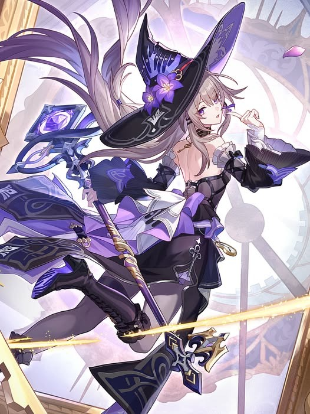

<div align="center">

<!-- Cosmic Wave Header (Obsidian Black & Herta Royal Purple) -->


### 🛰️ Station Terminal `[ID: HSS-YUU-83]`
*"Time is running out. What experiment are we running today?" — Madame Herta*

<a href="https://git.io/typing-svg">
  
</a>

<br><br>

<!-- Station Status & Social Badges -->
<a href="https://github.com/yuuuukoito">
  
</a>
&nbsp;
<a href="https://instagram.com/yuuukoito" target="_blank">
  
</a>
&nbsp;
<a href="https://discord.gg/lilyamanee._33887" target="_blank">
  
</a>
&nbsp;


</div>

<br>

---

### 📂 Station Personnel Dossier

```ini
[HERTA_SPACE_STATION // ARCHIVE_RECORD_83]
RESEARCHER      = "Yuu" (yuuuukoito)
CLEARANCE       = "Level 4 // Special Access — Curio Collection & Master Control"
AFFILIATION     = "Herta Space Station 🛰️"
DEPARTMENTS     = ["Department of Implement (器具部)", "Department of Insight (求索部)"]
COGNITIVE_PATH  = "The Erudition (智识) 🔮"
SPECIALIZATIONS = ["Web Frontend Development", "IoT & Embedded Arduino Systems", "Sensor Telemetry"]
CURRENT_STATUS  = "Calibrating Simulated Universe Blessings & Compiling Subspace Relays ✨"
DIAGNOSTIC      = "All subsystems nominal. Ready to deploy cosmic innovations."
```

---

### 🔮 Simulated Universe: Technical Curios & Blessings

<div align="center">

<table>
  <thead>
    <tr>
      <th align="center" width="26%">STATION SUPERVISOR</th>
      <th align="left" width="28%">STATION SECTOR & PATH</th>
      <th align="left" width="46%">TECHNICAL ARSENAL</th>
    </tr>
  </thead>
  <tbody>
    <tr>
      <td rowspan="5" align="center" valign="middle">
        
        <br><br>
        <sub><b>Madame Herta</b><br><i>Genius Society #83</i></sub>
      </td>
      <td>
        🔮 <b>Department of Insight</b><br>
        <sub>*Holographic Web & UI Nexus*<br>*(Path of The Erudition)*</sub>
      </td>
      <td>
        <a href="https://developer.mozilla.org/"></a>
        <a href="https://w3.org/html/"></a>
        <a href="https://w3schools.com/css/"></a>
        <a href="https://getbootstrap.com/"></a>
        <a href="https://flutter.dev"></a>
        <a href="https://www.chartjs.org"></a>
      </td>
    </tr>
    <tr>
      <td>
        📡 <b>Department of Revelation</b><br>
        <sub>*Subspace Backends & APIs*<br>*(Path of The Nihility)*</sub>
      </td>
      <td>
        <a href="https://nodejs.org/"></a>
        <a href="https://expressjs.com/"></a>
        <a href="https://www.php.net/"></a>
      </td>
    </tr>
    <tr>
      <td>
        🗄️ <b>Department of Ecology</b><br>
        <sub>*Curio Data Vaults*<br>*(Path of The Preservation)*</sub>
      </td>
      <td>
        <a href="https://www.mysql.com/"></a>
        <a href="https://www.sqlite.org/"></a>
      </td>
    </tr>
    <tr>
      <td>
        🤖 <b>Department of Implement</b><br>
        <sub>*Hardware, IoT & Sensors*<br>*(Path of The Destruction)*</sub>
      </td>
      <td>
        <a href="https://isocpp.org/"></a>
        <a href="https://www.arduino.cc/"></a>
        <a href="https://espressif.com/"></a>
      </td>
    </tr>
    <tr>
      <td>
        🚀 <b>Curio Gallery & Workspaces</b><br>
        <sub>*Simulation Engines & Tools*<br>*(Path of The Elation)*</sub>
      </td>
      <td>
        <a href="https://unity.com/"></a>
        <a href="https://git-scm.com/"></a>
        <a href="https://github.com/"></a>
        <a href="https://code.visualstudio.com/"></a>
      </td>
    </tr>
  </tbody>
</table>

<br>

<!-- Skill Matrix -->
<a href="https://skillicons.dev">
  
  <br>
  
</a>

</div>

<br>

---

### 📊 Station Telemetry & Research Analytics

> *"Data collection in progress across the simulated galaxies. Recording commit frequency, language resonance, and contribution streaks."*

<p align="center">
  <a href="https://github.com/yuuuukoito">
    
  </a>
  &nbsp;
  <a href="https://github.com/yuuuukoito">
    
  </a>
</p>

<p align="center">
  <a href="https://github.com/yuuuukoito">
    
  </a>
</p>

<br>

<div align="center">
  <p>
    🔨 <b><i>"Kuru kuru~ Kuru rin~!"</i></b><br>
    <sub>🛰️ <b>HERTA SPACE STATION CENTRAL ARCHIVES</b> • Maintained by <a href="https://github.com/yuuuukoito">@yuuuukoito</a> • Genius Society Subsystem</sub>
  </p>
  <!-- Cosmic Wave Footer (Herta Royal Purple & Obsidian Black) -->
  
</div>
